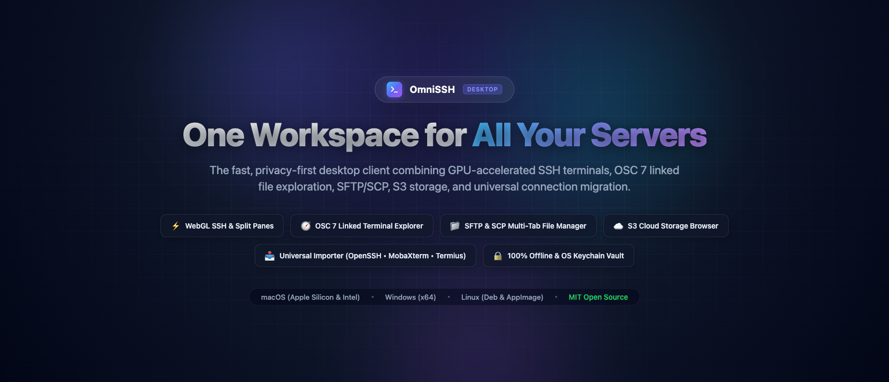
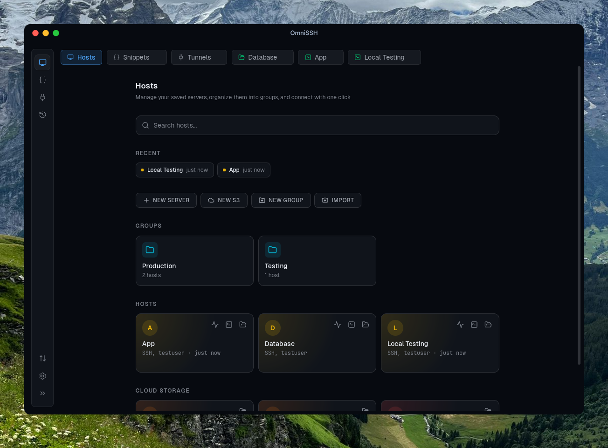
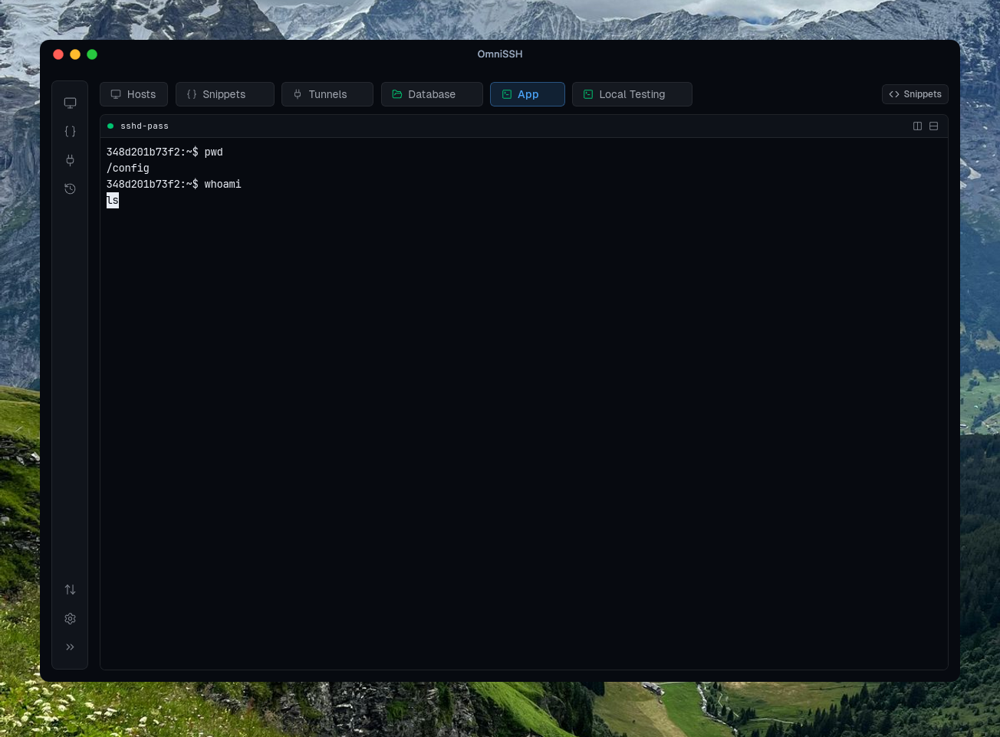
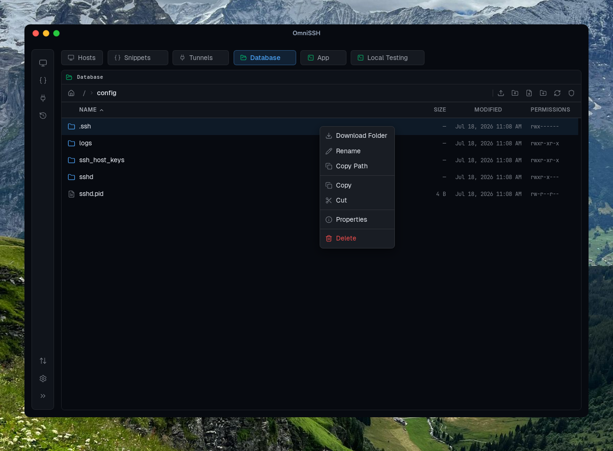
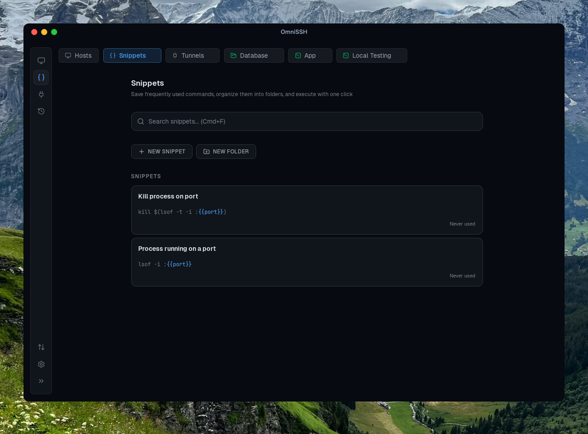

<p align="center">
  
</p>

<h1 align="center">OmniSSH</h1>

<p align="center">
  <strong>The modern, privacy-first desktop workspace for SSH Terminals, SFTP/SCP File Management, S3 Cloud Storage, and Multi-Source Session Management.</strong>
</p>

<p align="center">
  <a href="#-overview">Overview</a> &bull;
  <a href="#-key-features">Features</a> &bull;
  <a href="#-comparison">Comparison</a> &bull;
  <a href="#-screenshots">Screenshots</a> &bull;
  <a href="#-installation">Installation</a> &bull;
  <a href="#-building-from-source">Building</a> &bull;
  <a href="#-architecture">Architecture</a> &bull;
  <a href="#-credits--acknowledgments">Credits</a> &bull;
  <a href="#-license">License</a>
</p>

<p align="center">
  
  
  
  
  <a href="LICENSE"></a>
</p>

---

> ### 📢 Fork & Attribution Notice
> **OmniSSH** is an actively developed fork of [**anySCP**](https://github.com/macnev2013/anySCP), originally created and architected by **[Nevil Macwan (@macnev2013)](https://github.com/macnev2013)** under the MIT License.
>
> We extend our sincere gratitude to Nevil and the original contributors for designing the foundational architecture, Tauri v2 backend, and sleek interface. OmniSSH builds upon this foundation with multi-channel SSH multiplexing, real-time OSC 7 linked terminal file exploration, universal connection importers (MobaXterm & offline Termius LevelDB decryption), and enhanced file transfer capabilities.

---

## 🚀 Overview

**OmniSSH** is a high-performance, cross-platform desktop application that unifies your remote infrastructure workflows into a single privacy-first tool:

- **GPU-Accelerated SSH Terminals** with split panes, regex search, and command snippet automation.
- **Linked Terminal Explorer** that follows your shell's working directory in real time via **OSC 7** notifications.
- **Multi-Tab SFTP / SCP File Manager** with drag-and-drop uploads, conflict resolution, and VS Code remote editing.
- **S3 Cloud Storage Desktop Browser** compatible with AWS S3, MinIO, Cloudflare R2, Backblaze B2, Wasabi, and DigitalOcean Spaces.
- **Universal Connection Importer** allowing one-click migration from **OpenSSH** (`~/.ssh/config`), **MobaXterm** session files, and **Termius** local encrypted databases (with zero cloud dependency).
- **SSH Port Forwarding & Tunnels** for local and remote port redirection with service presets.
- **Zero Cloud, Local-First Security**: No mandatory logins, no telemetry, and credentials securely sealed in your operating system's native keychain.

---

## ⚡ Comparison

| Feature / Capability | OmniSSH | Termius | WinSCP | MobaXterm | PuTTY | Cyberduck |
| :--- | :---: | :---: | :---: | :---: | :---: | :---: |
| **SSH Terminal** | **Yes (WebGL)** | Yes | No | Yes (X11) | Yes | No |
| **Linked Terminal File Explorer** | **Yes (OSC 7)** | No | No | Yes | No | No |
| **SFTP & SCP Multi-Tab Browser** | **Yes** | Yes | Yes | Yes | No | Yes |
| **S3 Cloud Storage Browser** | **Yes** | No | No | No | No | Yes |
| **Split Terminal Panes** | **Yes (H / V)** | Yes | No | Yes | No | No |
| **Universal Import (OpenSSH, MobaXterm, Termius)** | **Yes** | No | No | No | No | No |
| **SSH Port Forwarding Rules** | **Yes** | Yes | No | Yes | Yes | No |
| **Command Snippets & Templates** | **Yes** | Yes | No | Yes | No | No |
| **Cross-Platform (macOS, Windows, Linux)** | **Yes** | Yes | Windows only | Windows only | Windows only | macOS/Windows |
| **Zero-Cloud & 100% Offline** | **Yes** | No (Cloud sync) | Yes | Yes | Yes | Yes |
| **Open Source (MIT)** | **Yes** | No (Proprietary) | Yes (GPL) | No (Freemium) | Yes (MIT) | Yes (GPL) |
| **Credential Storage** | **Native OS Keychain** | Cloud Account | Plain/Registry | INI/Registry | Registry | Keychain |

---

## ✨ Key Features

### 💻 1. Advanced SSH Terminal Client
* **High Performance Rendering**: Built on `xterm.js` with WebGL GPU acceleration for seamless scrolling and low latency.
* **Split Panes**: Divide terminals horizontally and vertically within any active session tab.
* **Interactive Terminal Search**: Full-text and regex search across your entire terminal scrollback buffer.
* **Customizable SSH Configurations**: Support for custom ports, keep-alive intervals, startup scripts/commands, default shells, and multi-hop **ProxyJump (bastion hosts)**.
* **Key Authentication**: Automated PPK-to-OpenSSH key conversion, passphrases, and private key identity files.

### 🧭 2. Linked Terminal Explorer & OSC 7 CWD Sync
* **Side-by-Side File Dock**: Open a dedicated remote filesystem panel docked directly beside your active terminal.
* **Live Directory Tracking (OSC 7)**: As you `cd` in your remote shell, the linked file explorer automatically follows your current working directory without manual refresh.
* **Shell Integration Wizard**: Built-in one-click shell hook generator for **Bash**, **Zsh**, and **Fish**.
* **Independent Channel Ownership**: Operates on an isolated SSH subsystem channel to ensure heavy file transfers never freeze or degrade your terminal session.

### 📥 3. Universal Connection Importer
* **OpenSSH `~/.ssh/config`**: Effortlessly import hosts, identities, aliases, and proxy tunnels.
* **MobaXterm (`.ini`, `.mxtsessions`, `.mxtpro`)**: Reads exported bookmarks and session structures, resolves portable drive paths (`_MobaXterm_Drive_...`), and preserves hierarchical folder groupings.
* **Termius Local Offline Database**: Securely extracts and decrypts local v8 LevelDB entities using authenticated AES-GCM and XSalsa20-Poly1305 decryption directly into your OS Keychain—100% offline with zero cloud dependency.
* **Selective Previews & Atomic Commits**: Review all detected connections, select individual hosts, map custom host groups, and commit transactionally with automatic rollback protection.

### 📁 4. SFTP & SCP Multi-Protocol File Explorer
* **Tabbed Remote Browsing**: Open multiple remote servers and directories in concurrent tabs.
* **Drag-and-Drop Operations**: Drag files and folders from your native desktop (Finder/Explorer) directly into the remote file tree.
* **Conflict Resolution**: Smart overwrite dialog with file size/timestamp comparison and batch actions (Overwrite, Skip, Cancel).
* **Remote Editing in VS Code**: Open remote files directly in your local editor—OmniSSH automatically watches and uploads changes upon saving.
* **Protocol Fallback**: Automatically switches between SFTP and SCP transports depending on remote server capabilities.
* **Transfer Queue Management**: Real-time progress indicators, transfer speed calculation, ETA, and concurrent file worker pools.

### ☁️ 5. S3 Cloud Storage Desktop Browser
* **Universal S3 Compatibility**: Connect seamlessly to **Amazon S3**, **MinIO**, **Cloudflare R2**, **Backblaze B2**, **Wasabi**, **DigitalOcean Spaces**, or private S3 endpoints.
* **Unified UI**: Enjoy the same file management features (drag-and-drop, multi-select, search, sorting) across both SFTP and S3 views.
* **Presigned URLs**: Instantly generate and copy time-limited presigned download URLs for easy file sharing.
* **Multi-Bucket Navigation**: Switch between buckets dynamically within a single connection.

### 🔀 6. SSH Port Forwarding (Tunnels)
* **Local & Remote Port Forwarding**: Establish persistent background SSH tunnels for secure access to remote databases and internal services.
* **Preset Templates**: One-click tunnel configurations for PostgreSQL, MySQL, Redis, MongoDB, HTTP/HTTPS, and Kubernetes APIs.
* **Independent Lifecycle**: Tunnels manage their own background connections without requiring an open interactive terminal.

### 📋 7. Command Snippets & Parametric Templates
* **Reusable Script Library**: Save frequently used commands, shell scripts, and administration snippets.
* **Template Placeholders**: Define dynamic variables using `{{variable_name}}` syntax that prompts for inputs before executing.
* **Quick Insert**: Palette-accessible drawer inside any active terminal session.

### 🔐 8. Security & Privacy First
* **OS-Level Keyring Security**: Passwords and private keys are stored exclusively in your operating system's native secure credential vault (macOS Keychain, Windows Credential Manager, Linux Secret Service).
* **Zero Telemetry**: No tracking, no external API calls, and no analytics.
* **Memory Protection**: Sensitive key data is zeroized in memory upon completion of operations.

---

## 📸 Screenshots

| Connection Manager & Dashboard | Multi-Pane SSH Terminal & Search |
| :---: | :---: |
|  |  |
| *Organize hosts with groups, colors, and health checks* | *Split panes, regex search, and tabbed sessions* |

| Linked & Standalone File Explorer | Command Snippets & Variables |
| :---: | :---: |
|  |  |
| *SFTP & S3 with drag-and-drop and conflict handling* | *Parameterized templates with quick insertion* |

---

## 📥 Installation

### Pre-Built Releases
Download the latest binaries for your platform from the [Releases](https://github.com/lefos13/omniSSH/releases) page:

* **macOS (Apple Silicon & Intel)**: `.dmg`
  > *Note for macOS*: If Gatekeeper prompts with an unverified developer warning, run:
  > ```bash
  > xattr -cr /Applications/OmniSSH.app
  > ```
* **Windows**: `.msi` or `.exe` installer
* **Linux**: `.AppImage` or `.deb` package

---

## 🔨 Building from Source

### Prerequisites
- [Node.js](https://nodejs.org) (v18 or later)
- [pnpm](https://pnpm.io) (v9 or later)
- [Rust](https://rustup.rs) (latest stable toolchain)
- Platform development dependencies ([Tauri v2 Prerequisites](https://v2.tauri.app/start/prerequisites/))

### Development Setup

```bash
# 1. Clone the repository
git clone https://github.com/lefos13/omniSSH.git
cd omniSSH

# 2. Install frontend dependencies
pnpm install --frozen-lockfile

# 3. Start development server with hot-reload
pnpm tauri dev
```

### Production Build

```bash
# Compile frontend and package native desktop binaries
pnpm build
pnpm tauri build
```

---

## 🏗 Architecture

OmniSSH is built with a strict separation between a fast, memory-safe Rust backend and a reactive TypeScript/React user interface:

```
┌─────────────────────────────────────────────────────────────┐
│                      React 19 Frontend                      │
│   (Zustand Stores, Tailwind CSS v4, xterm.js WebGL, DND)    │
└──────────────────────────────┬──────────────────────────────┘
                               │ Tauri v2 IPC (Typed Invokes & Events)
┌──────────────────────────────┴──────────────────────────────┐
│                     Rust Backend (Tauri)                    │
├──────────────────────────────┬──────────────────────────────┤
│  SSH & Shell Multiplexing    │  SFTP / SCP Transport Engine │
│  (russh, async PTY channels) │  (russh-sftp, worker pools)  │
├──────────────────────────────┼──────────────────────────────┤
│  S3 Cloud Storage Driver     │  Universal Importers         │
│  (rust-s3, tokio runtime)    │  (OpenSSH, MobaXterm, Termius)│
├──────────────────────────────┼──────────────────────────────┤
│  Local SQLite Persistence    │  Native OS Keychain Vault    │
│  (rusqlite, zero-config)     │  (keyring, AES-GCM / Argon2) │
└──────────────────────────────┴──────────────────────────────┘
```

---

## 🧪 Testing & Verification

OmniSSH includes an extensive automated test suite spanning unit tests, integration contracts, and real Tauri end-to-end containerized automation:

```bash
# Run frontend unit & component tests
pnpm test

# Run Rust unit tests
cargo test --manifest-path src-tauri/Cargo.toml

# Run WebdriverIO containerized E2E test suite
make e2e
```

---

## 🤝 Contributing

Contributions, issues, and feature suggestions are welcome!

1. Fork the repository
2. Create a feature branch: `git checkout -b feature/my-feature`
3. Commit your changes: `git commit -m 'feat: add my feature'`
4. Push to your branch: `git push origin feature/my-feature`
5. Open a Pull Request

Please refer to [`AGENTS.md`](AGENTS.md) for architectural invariants, coding conventions, and testing guidelines.

---

## 🙏 Credits & Acknowledgments

* **Original Creator & Upstream Project**: Heartfelt thanks to **[Nevil Macwan (@macnev2013)](https://github.com/macnev2013)** for creating [anySCP](https://github.com/macnev2013/anySCP) and laying the groundwork for this desktop client.
* **[Tauri Framework](https://v2.tauri.app)**: For the high-performance native desktop runtime.
* **[russh](https://github.com/warp-tech/russh)** & **[russh-sftp](https://github.com/warp-tech/russh)**: Pure-Rust asynchronous SSH and SFTP implementations.
* **[xterm.js](https://xtermjs.org)**: For the terminal emulation engine.
* **[rust-s3](https://github.com/durch/rust-s3)**: For S3-compatible cloud storage operations.
* **[Lucide Icons](https://lucide.dev)** & **[Tailwind CSS](https://tailwindcss.com)**: For beautiful UI components and typography.

---

## 📄 License

This project is licensed under the **MIT License** — see the [LICENSE](LICENSE) file for details.
